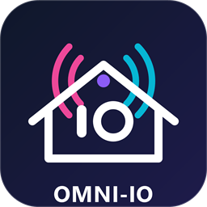

# Omni-IO — Open-Source ESP32 io-homecontrol® Gateway

  
   
  <strong>Next-Generation Open-Source 868MHz Gateway for io-homecontrol® Devices</strong>
    

  
  
  
  
  

---

## 🌟 Acknowledgments & Credits

**Omni-IO** stands on the shoulders of giants. This project is built upon the pioneering research, reverse engineering, and codebase contributions of several key members of the open-source home automation community:

* **[Velocet](https://github.com/Velocet)** — Author of [Velocet/iown-homecontrol](https://github.com/Velocet/iown-homecontrol): The groundbreaking reverse engineering, protocol specifications, CRC algorithms, and AES cryptography implementations for the io-homecontrol® protocol.
* **[cridp](https://github.com/cridp)** — Author of [cridp/iown-homecontrol-esp32sx1276](https://github.com/cridp/iown-homecontrol-esp32sx1276): Hardware adaptation and timing optimizations for the ESP32 and Semtech SX1276 radio transceiver.
* **[djbenbe](https://github.com/djbenbe)** — Author of [djbenbe/miopen.io](https://github.com/djbenbe/miopen.io/tree/Beta): Core firmware development, UI concept, graphics, and initial integration.
* **[rspaargaren](https://github.com/rspaargaren)** — Community documentation, troubleshooting guides, and [io-homecontrol Wiki](https://github.com/rspaargaren/iohomecontrol/wiki).
* **[CloudAXS](https://github.com/CloudAXS)** — Web interface architecture, modern responsive design, and multi-language engine.

*All respective trademarks and copyrights belong to their respective owners.*

---

## ✨ Features

* 📡 **868.95 MHz io-homecontrol® Radio Engine**:
  * Native 1-Way (1W) control for shutters, blinds, screens, and Velux/Somfy window openers.
  * 2-Way (2W) protocol frame sniffing, device discovery, and temperature/mode controls for compatible HVAC systems (Atlantic / Sauter / Thermor).
* 🌐 **Modern Built-in Web UI**:
  * Fully responsive mobile & desktop web interface served directly from LittleFS.
  * Real-time WebSocket connection for instant feedback and live RF traffic log stream.
  * Multi-language support with instant live switching (**Dutch**, **English**, **German**, and **French**).
  * Live status pills for both **MQTT** and **ESPHome** in the navbar with one-click settings navigation.
  * Direct device pairing, unpairing, renaming, and travel-time configuration.
  * Physical remote controller map manager.
* 🚀 **Home Assistant ESPHome Native API (Zero-Broker Integration)**:
  * Direct plug-and-play connection over TCP (port `6053`) without requiring an external MQTT broker.
  * Automatic mDNS discovery (`_esphomelib._tcp.local.`) under **Settings → Devices & Services**.
  * Dynamic entity discovery & re-enumeration: automatically refreshes entities in Home Assistant when devices are added, renamed, or removed.
  * Native cover entities with smooth position slider and Open/Close/Stop controls (`device_class: shutter`).
  * Number slider entity for live motor travel time calibration with instant feedback.
  * Button entities for Pairing, Adding, and Removing devices, plus a gateway soft restart button.
  * Gateway diagnostic sensors (WiFi RSSI, Free Memory, IP address).
* 🏠 **Home Assistant Auto-Discovery via MQTT**:
  * Automatic discovery for cover entities (blinds, screens, shutters).
  * Smooth percentage-based position control with travel time tracking.
  * Dedicated pairing and maintenance button entities.
  * Real-time state reporting (`OPEN`, `CLOSED`, `OPENING`, `CLOSING`, `STOP`).
  * Independent runtime toggle to enable/disable MQTT without clearing configuration.
* 🖥️ **OLED Display & Advanced Screen Manager**:
  * Real-time status display showing device name, WiFi signal, IP / mDNS address, CPU temperature, and status icons for both MQTT and ESPHome.
  * Pixel-art ESPHome status icon indicating connected / waiting Home Assistant sessions.
  * Runtime configurable screensaver timeout, screen-off timeout, and 3 dimming levels (Low, Medium, High).
* 📜 **Syslog & Remote Logging**:
  * Sends log messages directly to remote Syslog servers (RFC3164 / RFC5424 compliant).
* 💾 **Backup & Restore**:
  * One-click JSON backup and restore for device configurations and remote mappings.
  * Full backward-compatibility with legacy backup files.
* 🔄 **OTA (Over-The-Air) & Partitioning**:
  * Built-in OTA updates for both firmware and LittleFS filesystem from the web interface.

---

## 🛠️ Supported Hardware

| Hardware Board | Chip | Flash | Frequency | Notes |
| :--- | :--- | :--- | :--- | :--- |
| **LilyGo T-Beam v1.2** | ESP32 | 4MB | 868 MHz (SX1276) | Recommended / Full support |
| **LilyGo LoRa32 v2.1 (T3 v1.6.1)** | ESP32 | 4MB | 868 MHz (SX1276) | Integrated OLED |
| **Heltec LoRa32 v2** | ESP32 | 8MB | 868 MHz (SX1276) | Integrated OLED |
| **LilyGo T3-S3** | ESP32-S3 | 4MB | 868 MHz (SX1262/SX1276) | High-performance S3 SoC |

---

## 🚀 Quick Start Guide

### 1. Flash the Firmware
Download the latest ready-to-flash binaries from the [Releases](https://github.com/NH-Networks/Omni-IO/releases) page:
* Use the **merged single-file binary** (`<Board>.bin`) with [ESP Web Tools](https://esphome.github.io/esp-web-tools/) or `esptool.py`.

### 2. Connect to WiFi
1. On first boot, the ESP32 creates a setup Access Point named **`iohc-setup`**.
2. Connect to this WiFi network from your phone or PC.
3. The captive portal will open automatically. Select your home WiFi network and enter your password.

### 3. Open the Web Interface
Once connected to your network, open your web browser and navigate to:
👉 **[http://omni-io.local](http://omni-io.local)**  
*(or use the device IP address shown on the OLED screen / Serial monitor)*

---

## 🏠 Home Assistant Integration

Omni-IO provides two seamless integration paths into Home Assistant:

### Option A: ESPHome Native API (Recommended — No Broker Needed)
1. Ensure Omni-IO and your Home Assistant server are on the same local network.
2. In Home Assistant, go to **Settings → Devices & Services**.
3. Omni-IO will appear automatically as a discovered **ESPHome** device! Click **Configure** and **Submit**.
4. That's it! All configured covers, travel-time configuration sliders, pairing buttons, and diagnostic sensors appear immediately with sub-millisecond local response.

### Option B: MQTT Discovery
When MQTT is enabled, Omni-IO can also publish standard Home Assistant MQTT discovery topics:
1. In the Web UI, go to **Settings → MQTT**.
2. Enable MQTT, enter your MQTT Broker IP, port, username, and password.
3. Click **Save Settings**.
4. Home Assistant will discover the covers via MQTT!

#### MQTT Topics Structure
* **Command Topic**: `iown/<ID>/set` (`OPEN`, `CLOSE`, `STOP`)
* **Position Set Topic**: `iown/<ID>/position/set` (`0` to `100`)
* **State Topic**: `iown/<ID>/state` (`OPEN`, `CLOSED`, `OPENING`, `CLOSING`, `STOP`)
* **Position Feedback**: `iown/<ID>/position` (`0` to `100`)
* **Availability**: `iown/status` (`online` / `offline`)

---

## 📚 Documentation & Guides

Comprehensive guides and technical documentation are available in the [`docs/`](docs/) directory:

* 🔌 **[Hardware Setup & Pinouts](docs/HARDWARE_SETUP.md)** — Detailed wiring diagrams, pin definitions, antenna sizing, and board comparison.
* 🔄 **[Pairing & Calibration Guide](docs/PAIRING_GUIDE.md)** — Step-by-step motor pairing, travel time measurement, and wall remote mapping.
* 🏠 **[Home Assistant Integration](docs/HOME_ASSISTANT.md)** — Zero-config MQTT discovery, dashboard cards, and automation examples.
* 🌐 **[REST API & MQTT Reference](docs/API_AND_MQTT_REFERENCE.md)** — Complete API documentation for all REST endpoints, WebSockets, and MQTT topics.
* 🔧 **[Troubleshooting Guide](docs/TROUBLESHOOTING.md)** — Common issues and fixes for WiFi, mDNS, RF range, and OLED screens.
* 💻 **[Terminal & Serial Commands](COMMANDS.md)** — Full command reference for the serial console and web terminal.

---

## ⚠️ Disclaimer

This tool is designed for educational, testing, and smart-home integration purposes and is provided "as is" without warranty of any kind. The creators and contributors are not responsible for any misuse, damage, or malfunction caused by using this software or hardware.

---

## 📄 License & Attribution

* Code licensed under open-source terms.
* Documentation & Graphic assets © 2025–2026 by [djbenbe](https://creativecommons.org) and contributors, licensed under [CC BY-NC-ND 4.0](https://creativecommons.org/licenses/by-nc-nd/4.0/).
