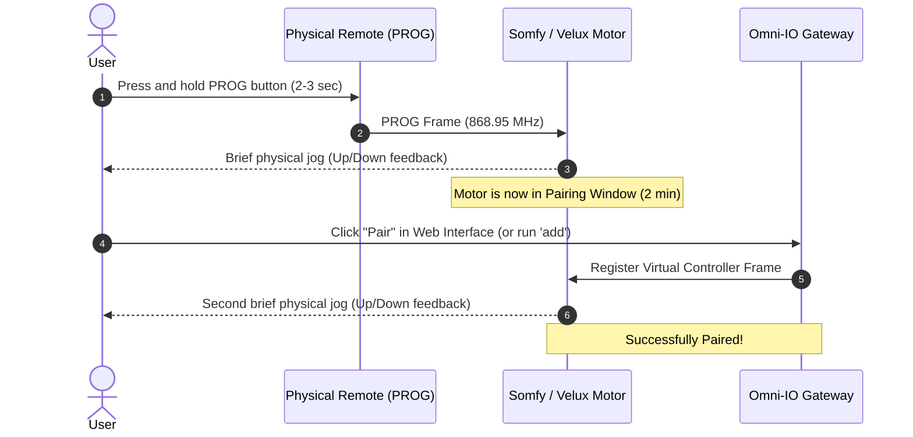

# Omni-IO Device Pairing & Calibration Guide

This guide walks you through pairing your **io-homecontrol®** blinds, roller shutters, screens, and Velux windows with **Omni-IO**, as well as configuring travel times and physical remote mappings.

---

## 1. Overview of 1W io-homecontrol Pairing

In 1-Way (1W) communication, Omni-IO acts as a virtual remote control transmitter registered directly with your motor receiver.

---

## 2. Step-by-Step Pairing Procedure

### Step 1: Create a Device in Omni-IO
1. Open the Omni-IO web interface at **[http://omni-io.local](http://omni-io.local)**.
2. In the navigation menu, go to **Devices**.
3. Click the **(+) Add Device** button.
4. Enter a descriptive name (e.g., `Living Room Shutter` or `Kitchen Velux`) and click **Save**.
5. The device will appear with a unique 3-byte hex address (e.g., `B60D1A`).

---

### Step 2: Put the Motor into Pairing Mode
1. Take the **existing physical remote** that currently operates the motor (e.g., Somfy Situo IO, Smoove IO, or Velux KLI 310).
2. Locate the small **PROG** button (often on the back of the remote or inside the battery compartment).
3. Press and hold the **PROG** button for approximately **2 to 3 seconds** until the motor performs a brief **jog** (short up-and-down movement).
4. The motor is now listening for new controllers.

---

### Step 3: Pair Omni-IO with the Motor
1. In the Omni-IO Web UI, click **Edit** on your newly created device.
2. Click the **Pair (Koppel)** button.
3. Omni-IO will transmit the registration frame.
4. The motor will perform another brief **jog** (up-and-down movement).
5. **Done!** Your device is now paired and can be controlled via the Web UI, MQTT, and Home Assistant.

---

## 3. Travel Time Calibration (Position Estimation)

Because 1W io-homecontrol motors do not report continuous live position feedback, Omni-IO calculates precise percentage positions ($0\% = \text{Closed}, 100\% = \text{Open}$) based on motor travel time.

### How to Calibrate:
1. Completely open the shutter or blind.
2. Use a stopwatch: press **Close** in Omni-IO and measure the exact time in seconds until the motor fully stops at the bottom limit.
3. Open the **Edit** dialog for the device in the Omni-IO Web UI.
4. Enter the measured duration in the **Travel Time (seconds)** field (e.g., `18`).
5. Click **Save**.

Omni-IO will now smoothly interpolate position updates and publish live percentages to Home Assistant during movement.

---

## 4. Physical Remote Mapping & Interception

If you use both physical wall remotes and Omni-IO, Omni-IO can listen for transmissions from your physical remotes and update Home Assistant in real time!

### How to Map a Physical Remote:
1. Press a button on your physical remote.
2. Check the **Status/Logs** page in Omni-IO: you will see the received 3-byte Remote ID (e.g., `4A1F9C`).
3. Go to **Remotes** in the Web UI.
4. Click **(+) Add Remote**, enter the ID and a name (e.g., `Living Room Wall Switch`).
5. Click **Edit** on the remote entry and select which virtual device(s) it is linked to.
6. Now, whenever the physical switch is pressed, Omni-IO will mirror the action in Home Assistant!

---

## 5. Unpairing a Device
If you ever want to remove Omni-IO from a motor:
1. Put the motor in pairing mode by holding the **PROG** button on your physical remote until the motor jogs.
2. In the Omni-IO Web UI, click **Edit** on the device and press **Unpair (Ontkoppel)**.
3. The motor will jog to confirm removal.
